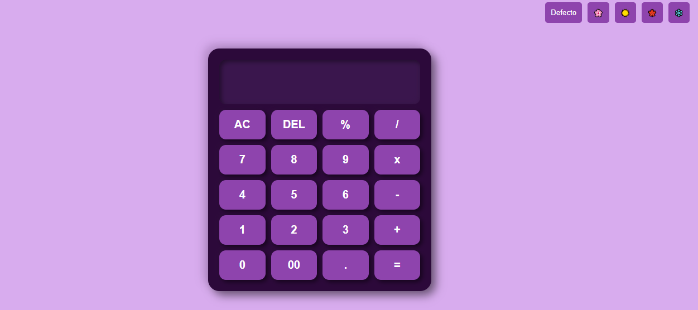

# **Calculadora con Temas Estacionales 🎨**

¡Explora las cuatro estaciones del año mientras realizas cálculos! Esta calculadora web interactiva combina funcionalidad con diseño estético, ofreciendo temas visuales inspirados en **Primavera**, **Verano**, **Otoño** e **Invierno**. Desarrollada con las tecnologías fundamentales de la web: **HTML**, **CSS** y **JavaScript**.

---

## 📍 **Screenshot**

  

---

## 📌 **Demo**

  

---

## ✨ **Características Destacadas**

- **Operaciones matemáticas básicas**: suma, resta, multiplicación y división.  
- **Cálculo avanzado**: incluye porcentajes, decimales y funciones para borrar (AC y DEL).  
- **Temas estacionales**:  
  - 🌸 **Primavera**: colores frescos y florales.  
  - ☀️ **Verano**: tonos cálidos y brillantes.  
  - 🍁 **Otoño**: paletas otoñales con tonos tierra.  
  - ❄️ **Invierno**: colores fríos y minimalistas.  
- **Diseño responsivo**: compatible con dispositivos de escritorio, tablet y móvil.  
- **Interfaz amigable**: controles intuitivos para una experiencia fluida.

---

## 🛠️ **Tecnologías Utilizadas**

  
  
  

---

## 🎯 **Funcionalidades**

### ⚙️ **Operaciones Matemáticas**
- **➕ Suma**  
- **➖ Resta**  
- **✖️ Multiplicación**  
- **➗ División**  
- **💯 Porcentajes**  

### 🔧 **Controles Adicionales**
- **AC**: Borra todo y reinicia la calculadora.  
- **DEL**: Elimina el último dígito ingresado.  
- **⚡ Resultado**: Muestra el cálculo final al presionar "=".  

### 🌟 **Temas Estacionales**
- Cambia entre los cuatro temas estacionales de forma dinámica.  
- Cada tema tiene su propio esquema de colores y diseño único.  
- Incluye un botón para restablecer el tema por defecto.

### 📱 **Diseño Responsivo**
- La interfaz se adapta a cualquier dispositivo:  
  - Escritorios  
  - Tablets  
  - Móviles  

---

## 🚀 **Cómo Usar**

1. **Selecciona un tema estacional**: Usa los botones en la parte superior derecha para cambiar entre Primavera, Verano, Otoño e Invierno.  
2. **Ingresa números**: Haz clic en el teclado numérico o usa tu teclado físico.  
3. **Realiza operaciones**: Selecciona un operador (➕, ➖, ✖️, ➗) y presiona el botón "=" para calcular.  
4. **Usa los controles adicionales**:  
   - **AC**: Reinicia la calculadora.  
   - **DEL**: Borra el último dígito ingresado.  

---

## 👩‍💻 **Autor**

Desarrollado con ❤️ por [Stefany Pérez](https://github.com/StefanyPerezBz).  
Si tienes alguna sugerencia o pregunta, no dudes en contactarme. 🚀
